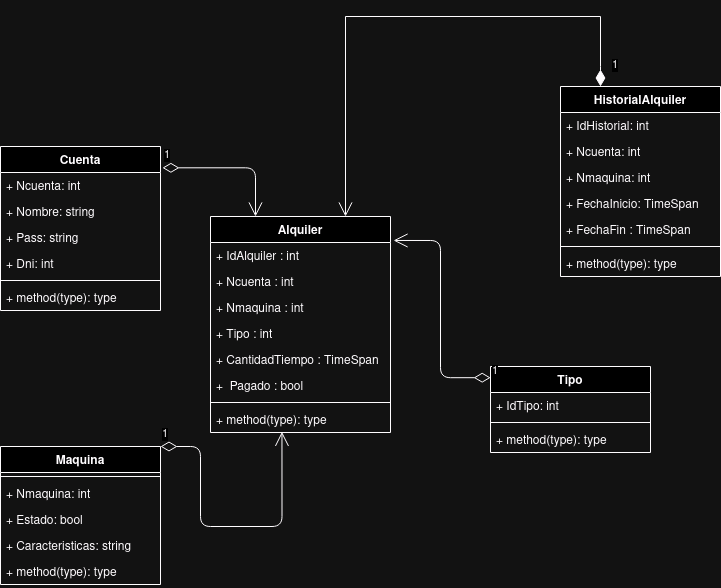
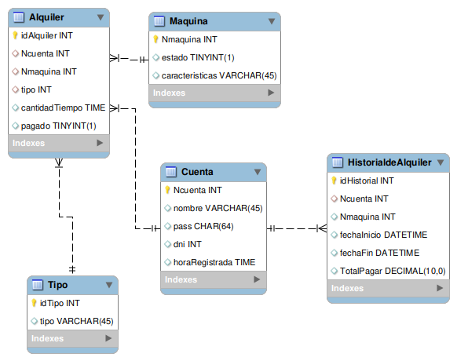

## INTEGRANTES 

<a href="https://github.com/Sherklan12e">
  
</a>
<a href="https://github.com/ET12JULIO">
  
</a>
<a href="https://github.com/quispeleon">
  
</a>
<br>
<br>
<br>
<br>
<br>
<br>


# Antes de correr el programa
Cambia estos datos con los tuyos , esta en src/Ciber.Test/itest.cs
```c#
public class TestAdo
{
    protected readonly IDAO Ado;
    private const string   _cadena = "Server=localhost;Database=LATABLA;Uid=LABASEDEDATOS;pwd=TUCONTRASEÑA;Allow User Variables=True";
    

    public TestAdo() => Ado = new CuentaRepository(_cadena);
    public TestAdo(string cadena) => Ado = new CuentaRepository(cadena);
} 
```

## Abre 2 terminales 
* <h4>Primer terminal 

Dirigete ala carpeta Scripts 
dentro de tu terminal, ejecuta 
```
mysql -u NombreDeBaseDeDatos -p 
```
te pedira tu contraseña 
Una vez dentro ejecuta 
```sql
source install.sql
```
* <h4>Segunda terminal
Dirigete ala carpeta Ciber.Test y ejecuta 
```c#
dotnet test
``` 


<!-- 
# use json para tu db
```json
{
  "ConnectionStrings": {
    "CiberDb": "Server=localhost;Database=5to_Ciber;Uid=5to_agbd;pwd=Trigg3rs!;Allow User Variables=True",
    "Ciber": "Server=localhost;Database=Ciber;Uid=5to_agbd;pwd=Trigg3rs!;Allow User Variables=True"

  }
} -->


<!-- using Microsoft.Extensions.Configuration;
var configuration = new ConfigurationBuilder()
                .SetBasePath(AppContext.BaseDirectory)
                .AddJsonFile("appsettings.json")
                .Build();

                        var cadena = configuration.GetConnectionString("CiberDb");

                        var cadena1 = configuration.GetConnectionString("Ciber"); -->

# DIAGRAMA DE CLASES 

# DER(DIAGRAMA DE ENTIDAD RELACION)
